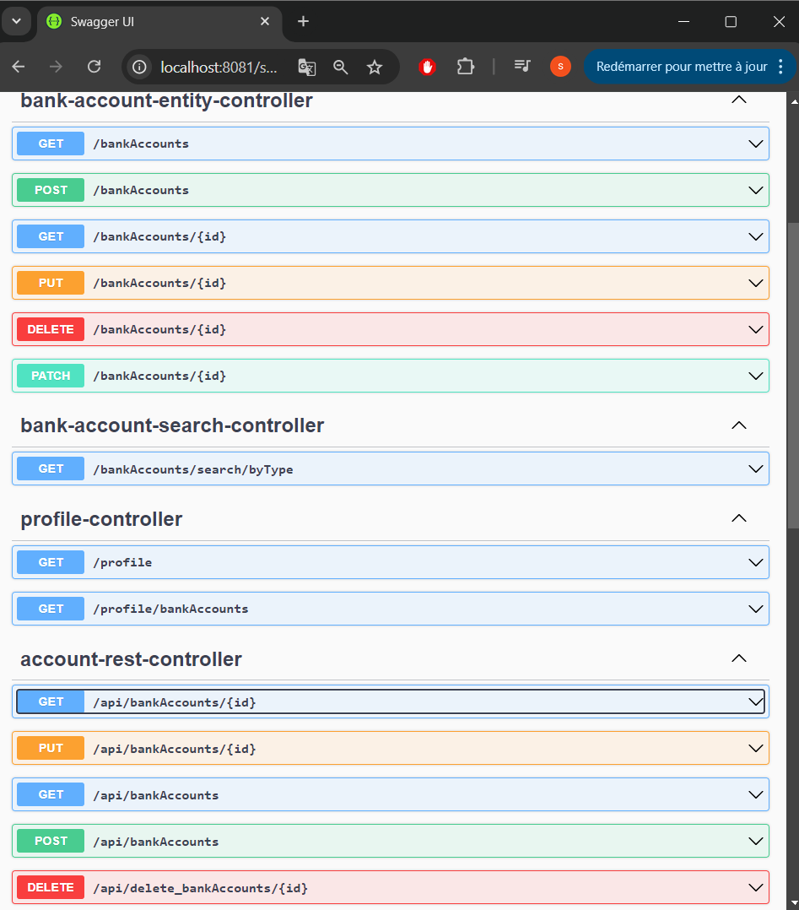

<h2>Développement d'un micro-service </h2>

<h4>Test la couche DAO :</h4>
<h5>Tester le web micro-service en utilisant un client REST comme Postman :</h5>

<h5>Test le web micro-service en utilisant un client REST comme Swagger :</h5>

<h5>Test Web service GraphQL pour ce Micro-service </h5>

